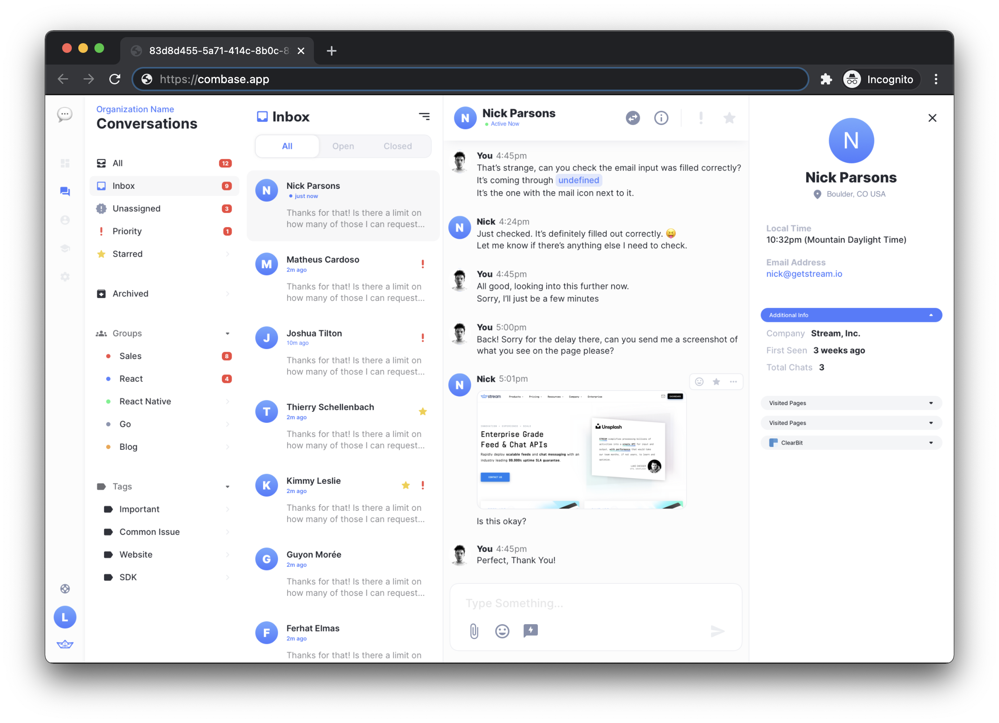
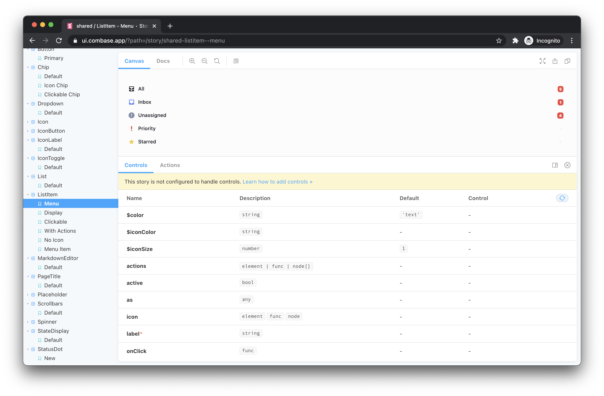
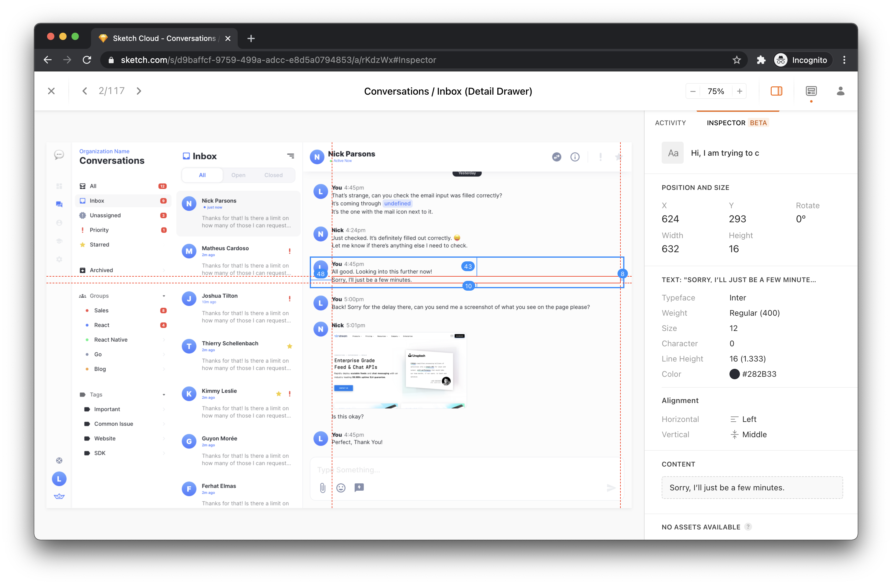

# Combase – A Powerful White-Label Chat Support Platform

> **Note**: Combase is currently under active development and is not ready for production use.

## What's Combase? 🤔

Combase is a fully functional and customizable chat support platform built for any use-case. Packed with an intuitive and exhaustive feature set, Combase can be easily extended for use with third-party APIs through the built-in plugin system. Stream Chat and Activity Feed APIs power Combase to ensure all conversations and interactions are lightning-fast.

## Features 🔮

- Support oriented realtime customer chat (polished for any support use-case) 💬
- Full email support (bidirectional chat and email workflow) 📬
- Agent friendly dashboard (an experience that makes sense) 😏
- Lightweight and embeddable widget (easily embed on any site or app) 🧩
- Realtime stats and metrics (detailed support overview) 👀
- Role and permission management (choose who does what) 🔑
- Built-in FAQ management (reduce support burden) 🤷‍♂️
- Automatic routing (timezone, schedule, and ticket load based logic) 🗺️
- Powerful plugins system (use existing plugins or build your own) 🧬
- Modern tech stack and event-driven architecture (come code with us) 👩‍💻
- Detailed UI component kit via Storybook (see what is possible) 💅

> Want see more? Try the online [demo](@TODO).

## Resources 🛠️

### Design Assets

#### React UI Components

    
    See what's possible with
    <a href="https://ui.combase.app" title="Sketch Cloud Link">
        Storybook 🔗
    </a>

#### Raw Sketch Assets

    
    Download and inspect on 
    <a href="https://www.sketch.com/s/d9baffcf-9759-499a-adcc-e8d5a0794853" title="Sketch Cloud Link">
        Sketch Cloud 🔗
    </a>

### Code 👨‍💻

The codebase is open-source and available on [Stream's GitHub](https://github.com/getstream/). The code has been decoupled into several repos.

- [Frontend](https://github.com/getstream/combase-frontend)
  - [Agent Dashboard](https://github.com/GetStream/combase-frontend/tree/main/packages/dashboard)
  - [In-App Widget](https://github.com/GetStream/combase-frontend/tree/main/packages/widget)
  - [UI Components](https://github.com/GetStream/combase-frontend/tree/main/packages/ui)
- [Backend](https://github.com/GetStream/combase-backend)
- [Plugins](https://github.com/GetStream/combase-plugins)
- [Webhook System](https://github.com/getstream/combase-webhooks)
  - [Ingress](https://github.com/GetStream/combase-webhooks/tree/main/packages/ingress)
  - [Worker](https://github.com/GetStream/combase-webhooks/tree/main/packages/worker)

All reusable code that is specific to Combase is published on [npm](https://www.npmjs.com/org/combase.app) under the [@combase.app](https://www.npmjs.com/org/combase.app) organization.
